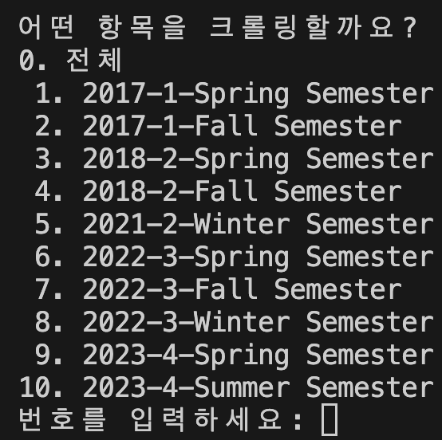

# HYWEP Crawler

<!--  -->

> HYU Portal(한양대학교 포털) 페이지를 크롤링하여 성적 엑셀파일로 만들어주는 python 스크립트입니다.  


## 0. 기본 구조

```
├── README.md
├── crawler.py (크롤러)
├── data_preprocess.py (전처리 모듈)
├── portal_grade_crawler.log (실행 로그)
├── main.py (크롤러 실행 스크립트)
└── requirements.txt (3rd-party 패키지 정보)
```

## 1. 환경설정

### 1-1. 파이썬 및 관련 패키지 설치

#### 1-1-1. 파이썬 설치

https://www.python.org/downloads/ 에서 파이썬 3.6이상 버전을 설치해주세요.

#### 1-2-2. 크롤링 관련 패키지 설치

```bash
pip install -r requirements.txt
```

### 1-2. 크롬 브라우저 설치

https://www.google.co.kr/chrome 에서 최신 버전의 크롬을 설치해주세요.


## 2. 크롤링

```bash
python main.py (한양인ID) (한양인PW)
```



#### <u>크롤링할 항목의 번호</u>를 입력한다.


## 3. 결과 확인

