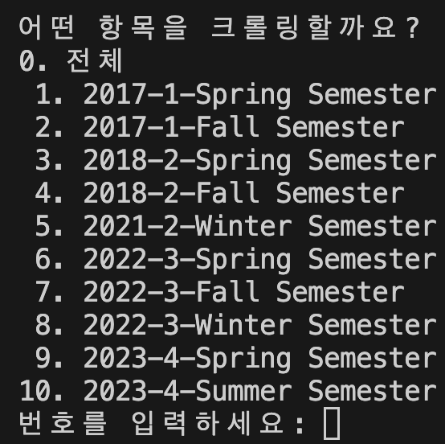

# HYWEP Crawler

[](https://www.youtube.com/watch?v=j6lgh2zTO3s?t=0s)

> HYU Portal(한양대학교 포털) 페이지를 크롤링하여 성적 엑셀파일로 만들어주는 python 스크립트입니다.  

## 0. 기본 구조

```
├── README.md
├── crawler.py (크롤러)
├── data_preprocess.py (전처리 모듈)
├── portal_grade_crawler.log (실행 로그)
├── main.py (크롤러 실행 스크립트)
└── requirements.txt (3rd-party 패키지 정보)
```

## 1. 환경설정

### 1-1. 파이썬 및 관련 패키지 설치

#### 1-1-1. 파이썬 패키지 관리자 설치

- Windows

  1. Powershell 열기

  2. 다음 명령어 실행
  ```powershell
  powershell -ExecutionPolicy ByPass -c "irm https://astral.sh/uv/install.ps1 | iex"
  ```

- Mac/Linux

  1. bash/zsh 쉘 실행

  2. 다음 명령어 실행
  ```bash
  curl -LsSf https://astral.sh/uv/install.sh | sh
  ```

#### 1-2-2. 크롤링 관련 패키지 설치

```bash
uv sync
```

### 1-2. 크롬 브라우저 설치

https://www.google.co.kr/chrome 에서 최신 버전의 크롬을 설치해주세요.

## 2. 크롤링

```bash
uv run main.py (한양인ID) (한양인PW)
# or
uv run main.py
```



#### <u>크롤링할 항목의 번호</u>를 입력한다.


## 3. 결과 확인


